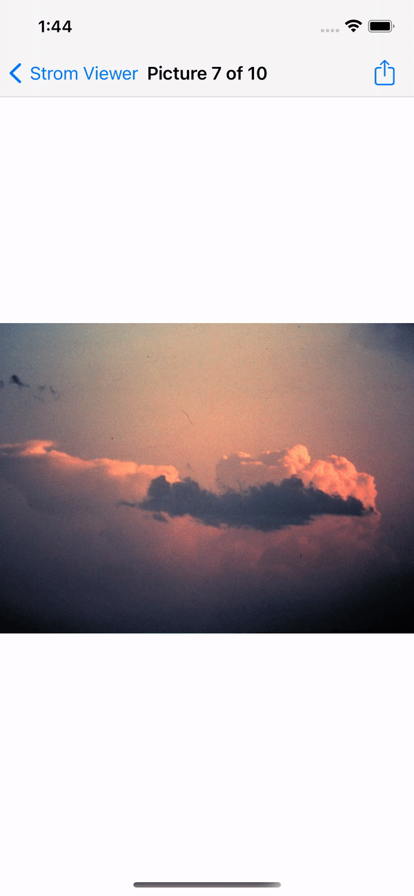

# Storm Viewer
A simple storm viewer.

# Menu
* [Screenshots](#screenshots)
* [Source](#source)
* [Contributions](#contributions)
* [Contact](#contact)

# New

- UIActivityViewController
* .popoverPresentationController
* .completionWithItemsHandler

# Screenshots

* .hidesBarsOnTap

# Source
[Hacking With Swift](https://twitter.com/twostraws)

# Contributions

* All kinds of contributions (enhancements, new features, documentation & code improvements, issues & bugs reporting & todo task) are welcome. Let's make it better.

# Contact
Created by [Terry Kuo](https://twitter.com/ArgonYoYo) - feel free to contact me!
